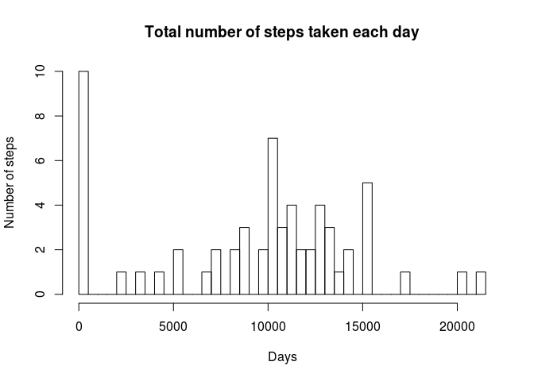
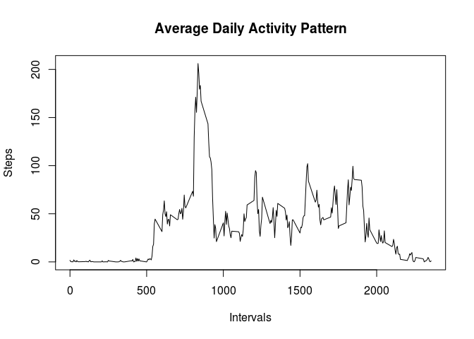
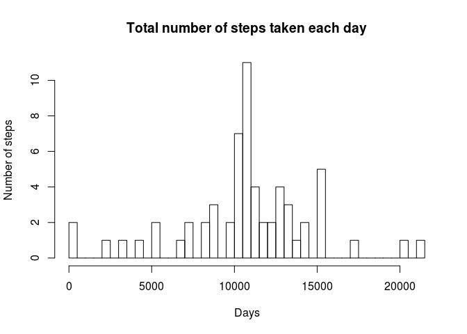
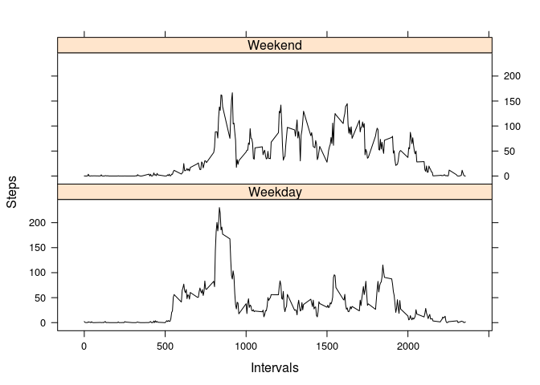

Loading and preprocessing the data
----------------------------------

1.  Load the data (i.e. `read.csv()`)
2.  Process/transform the data (if necessary) into a format suitable for
    your analysis

<!-- -->

    unzip(zipfile = "activity.zip")
    activity <- read.csv("activity.csv")

What is mean total number of steps taken per day?
-------------------------------------------------

1.  Make a histogram of the total number of steps taken each day

<!-- -->

    steps.total <- tapply(activity$steps, 
                         activity$date, 
                         FUN = sum, 
                         na.rm = TRUE)

    hist(steps.total, breaks=40, 
         main="Total number of steps taken each day", 
         xlab="Days", ylab="Number of steps")

  
 2. Calculate and report the **mean** and **median** total number of
steps taken per day

    mean(steps.total, na.rm = TRUE)

    ## [1] 9354.23

    median(steps.total, na.rm = TRUE)

    ## [1] 10395

What is the average daily activity pattern?
-------------------------------------------

1.  Make a time series plot (i.e. `type = "l"`) of the 5-minute interval
    (x-axis) and the average number of steps taken, averaged across all
    days (y-axis)

<!-- -->

    steps.averages <- aggregate(x = list(steps = activity$steps), 
                                by = list(interval = activity$interval), 
                                FUN = mean, 
                                na.rm = TRUE)

    plot(steps.averages, type='l', main='Average Daily Activity Pattern',
         ylab='Steps', xlab='Intervals')

  
 2. Which 5-minute interval, on average across all the days in the
dataset, contains the maximum number of steps?

    steps.averages$interval[which.max(steps.averages$steps)]

    ## [1] 835

Imputing missing values
-----------------------

1.  Calculate and report the total number of missing values in the
    dataset (i.e. the total number of rows with `NAs`)

<!-- -->

    missingFunc <- function(values) sum(is.na(values))
    sapply(activity, missingFunc)

    ##    steps     date interval 
    ##     2304        0        0

1.  Devise a strategy for filling in all of the missing values in the
    dataset. The strategy does not need to be sophisticated. For
    example, you could use the mean/median for that day, or the mean for
    that 5-minute interval, etc.

2.  Create a new dataset that is equal to the original dataset but with
    the missing data filled in.

<i>As it can be seen from the output above we have missing values only
in `steps` field. I decided to change `NA` values by the average number
of steps for such field.</i>

    #Get NA's indexes and duplicate table
    missingRows <- is.na(activity$steps)
    replacedNAs <- activity

    #Create key-value dictionary with interval-steps pairs
    keyvalue <- as.list(steps.averages[[2]])
    names(keyvalue) <- as.list(steps.averages[[1]])

    #Replace NA values by the values from the dictionary
    intervalsOfMissing <- as.character(activity$interval[missingRows])
    replacedSteps <- sapply(intervalsOfMissing, 
                            FUN = function(x) {keyvalue[[x]]}, 
                            USE.NAMES = FALSE)

    #Update the table
    replacedNAs$steps[missingRows] <- replacedSteps

1.  Make a histogram of the total number of steps taken each day and
    Calculate and report the mean and median total number of steps taken
    per day. Do these values differ from the estimates from the first
    part of the assignment? What is the impact of imputing missing data
    on the estimates of the total daily number of steps?

<!-- -->

    steps.total <- tapply(replacedNAs$steps, replacedNAs$date, FUN = sum)
    hist(steps.total, breaks=40, 
         main="Total number of steps taken each day", 
         xlab="Days", ylab="Number of steps")

  

    mean(steps.total, na.rm = TRUE)

    ## [1] 10766.19

    median(steps.total, na.rm = TRUE)

    ## [1] 10766.19

<i>The mean and median have been changed and the distribution lost its
skewness. Now the distribution has a look more similar to normal
distribution, because **median=mean**. The reason why previous
distribution had another values is because the total number of steps
taken in NA fields are set to 0s by default. So we had skewness towards
the left side.</i>

Are there differences in activity patterns between weekdays and weekends?
-------------------------------------------------------------------------

1.  Create a new factor variable in the dataset with two levels --
    "weekday" and "weekend" indicating whether a given date is a weekday
    or weekend day.

<!-- -->

    determine.weekend <- function(date) {
      day <- weekdays(date)
      if (day %in% c("Saturday", "Sunday")) return("Weekend")
      else return("Weekday")
    }

    #Find all weekends in the table
    replacedNAs$date <- as.Date(replacedNAs$date)
    replacedNAs$days <- sapply(replacedNAs$date, determine.weekend)

1.  Make a panel plot containing a time series plot (i.e. `type = "l"`)
    of the 5-minute interval (x-axis) and the average number of steps
    taken, averaged across all weekday days or weekend days (y-axis).

<!-- -->

    library(lattice)
    steps.averages <- aggregate(steps ~ interval + days, data = replacedNAs, mean)
    xyplot(steps~interval|days, type='l', data = steps.averages, layout=c(1,2), xlab = "Intervals", ylab = "Steps", col = 'black')

